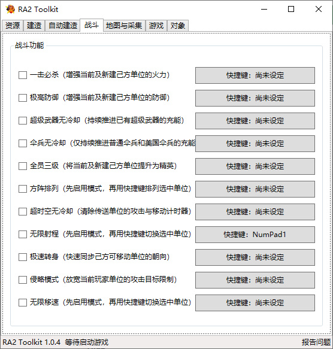
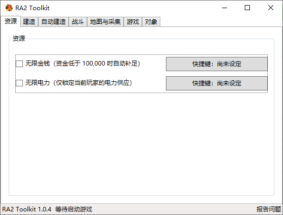
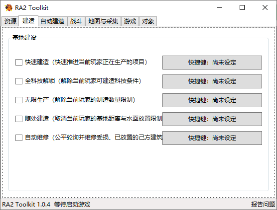
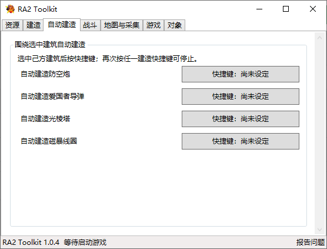
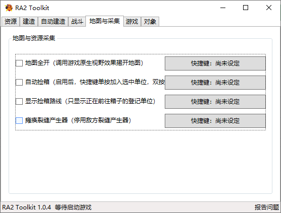
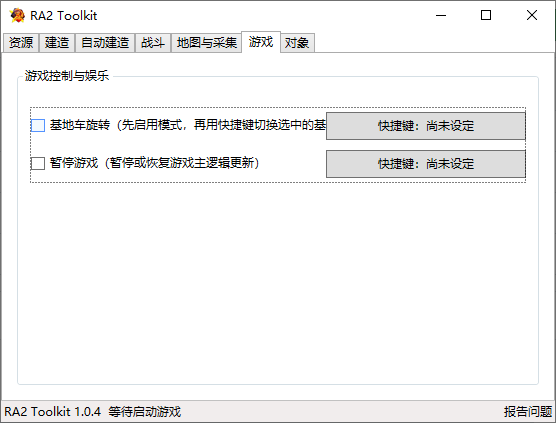
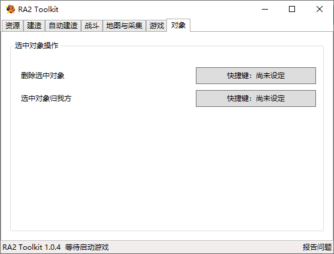

# 通知
很抱歉，由于在设计代码之处没有考虑好设计模式，导致后续的改动经常出现莫名其妙的问题，我们决定暂停此项目，不久的将来我们会另起炉灶，敬请期待
# RA2 Toolkit

RA2 Toolkit 是一款面向《红色警戒 2：尤里的复仇》的 Windows x64 桌面辅助工具。它通过 WPF 控制面板和可自定义的全局快捷键，提供资源、建造、战斗、地图采集、游戏控制及选中对象操作，主要用于单人游戏和本地测试。

[下载最新版](https://github.com/pitifulbug/ra2-toolkit/releases/latest) · [查看发布记录](https://github.com/pitifulbug/ra2-toolkit/releases) · [反馈问题](https://github.com/pitifulbug/ra2-toolkit/issues/new)

> [!IMPORTANT]
> 程序需要以管理员身份运行，才能读取和控制游戏进程。请遵守所使用平台或服务器的规则，不要将本工具用于破坏其他玩家的游戏体验。

## 项目特点

- **桌面控制中心**：按资源、建造、战斗等类别集中管理所有功能。
- **全局快捷键**：可为每项功能单独绑定按键，在游戏窗口中直接触发。
- **自动连接**：工具和游戏可以按任意顺序启动；游戏退出或对局结束后，工具会继续等待下一次连接。
- **版本校验**：只连接经过审核的游戏程序版本，降低内存偏移不匹配造成异常的风险。
- **联机限制**：检测到 LAN 或 Internet 对局时，自动阻止并恢复会直接改变战局的受限功能。

## 界面预览



<details>
<summary>查看全部功能页面</summary>

| 资源 | 建造 |
| --- | --- |
|  |  |

| 自动建造 | 地图与采集 |
| --- | --- |
|  |  |

| 游戏 | 对象 |
| --- | --- |
|  |  |

</details>

## 功能概览

| 分类 | 功能 |
| --- | --- |
| 资源 | 无限金钱、无限电力 |
| 建造 | 快速建造、全科技解锁、无限生产、随处建造、自动维修 |
| 自动建造 | 围绕选中的己方建筑自动建造防空炮、爱国者导弹、光棱塔或磁暴线圈 |
| 战斗 | 一击必杀、极高防御、超级武器无冷却、伞兵无冷却、全员三级、方阵排列、超时空无冷却、无限射程、极速转身、侵略模式、无限移速 |
| 地图与采集 | 地图全开、自动捡箱、显示捡箱路线、瘫痪裂缝产生器 |
| 游戏 | 基地车旋转、暂停游戏 |
| 对象 | 删除选中对象、选中对象归我方 |

## 下载与运行

### 运行要求

- Windows x64。
- 《红色警戒 2：尤里的复仇》及受支持的游戏程序版本。
- 管理员权限；启动时 Windows 会显示 UAC 提示。

[Releases](https://github.com/pitifulbug/ra2-toolkit/releases/latest) 通常提供两种 Windows x64 单文件构建，具体名称以对应版本的发行说明为准：

| 类型 | 说明 |
| --- | --- |
| 独立版（Self-contained） | 已包含 .NET 运行时，文件较大，无需额外安装运行库；不确定时建议选择此版本 |
| 轻量版（Framework-dependent） | 文件较小，需要安装发行说明所要求的 .NET Desktop Runtime x64 |

### 快速开始

1. 打开 [最新版本下载页](https://github.com/pitifulbug/ra2-toolkit/releases/latest)，选择适合自己的构建。
2. 运行下载的 `.exe` 文件，并允许管理员权限请求。
3. 启动游戏并进入对局。工具和游戏的启动顺序不限，连接状态会显示在窗口底部。
4. 在控制面板中启用所需功能，并按需设置右侧的快捷键。

关闭工具窗口时，程序会先尝试恢复由它控制的游戏状态，再安全退出。

## 使用说明

### 全局快捷键

快捷键默认不预设。点击功能右侧的“快捷键：尚未设定”，然后按下普通按键或包含 `Ctrl`、`Shift`、`Alt` 的组合键即可保存。

- 按 `Delete` 或 `Backspace` 清除当前功能的快捷键。
- 按 `Esc` 取消本次设置。
- 已被其他功能占用的按键会提示冲突。
- 快捷键为全局监听，焦点位于游戏窗口时仍可使用。

快捷键配置保存在：

```text
%LocalAppData%\RA2 Toolkit\hotkeys.json
```

### 功能操作方式

| 类型 | 使用方法 | 对应功能 |
| --- | --- | --- |
| 开关型 | 在控制面板勾选，或通过快捷键切换开关 | 大多数资源、建造、战斗和地图功能 |
| 模式 + 动作型 | 先在控制面板启用模式，再选中目标并按快捷键 | 方阵排列、无限射程、无限移速、基地车旋转 |
| 动作型 | 先绑定快捷键，再选中目标并按快捷键执行 | 四种自动建造、删除选中对象、选中对象归我方 |
| 自动捡箱 | 先勾选总开关；单按快捷键加入选中单位，连续双按移除 | 自动捡箱 |

使用需要选中目标的功能时，请注意：

- **自动建造**：先选中一个己方建筑，再按目标防御建筑对应的快捷键；再次按任一自动建造快捷键可停止当前自动建造。
- **方阵排列、无限射程、无限移速**：先启用对应模式，再选择己方单位并按快捷键。
- **基地车旋转**：先启用模式，再选择己方基地车并按快捷键。
- **自动捡箱**：只会登记选中的己方可移动单位。单人对局中没有可用箱子时，单位会尝试返回己方建造场或出生点附近等待；联机对局中则会在当前位置等待。
- **对象操作**：“选中对象归我方”只对可转换的对象生效；“删除选中对象”不可撤销，请谨慎使用。

## 游戏兼容性

程序会自动检测以下游戏进程：

- `gamemd.exe`
- `gamemd-ares.exe`
- `gamemd-spawn.exe`

进程名称相同并不代表一定兼容。程序还会校验游戏文件的 SHA-256，只允许源码中已经审核的精确版本；同时检测到多个游戏进程时也会拒绝连接。

如果窗口底部提示游戏版本不受支持，请不要绕过校验。可点击窗口中的“报告问题”，或直接[提交 Issue](https://github.com/pitifulbug/ra2-toolkit/issues/new)，并附上以下信息：

- RA2 Toolkit 版本。
- 游戏程序文件名及错误提示中的 SHA-256。
- 问题现象和可复现步骤。

## 联机限制

RA2 Toolkit 主要面向单人游戏和本地测试。检测到 LAN 或 Internet 对局时，程序会禁用并恢复大多数会改变本地模拟状态的功能；控制面板中会将这些功能标记为“联机对局中不可用”。自动捡箱和路线显示不在这组限制内，但这不代表它们符合所有服务器的规则，请以实际平台规定为准。

## 从源码构建

开发环境需要 Windows x64 和 [.NET 10 SDK](https://dotnet.microsoft.com/download/dotnet/10.0)。

```powershell
git clone https://github.com/pitifulbug/ra2-toolkit.git
Set-Location .\ra2-toolkit
dotnet build .\ra2-toolkit.slnx -c Release
```

运行开发版本：

```powershell
dotnet run --project .\src\RA2Toolkit\RA2Toolkit.csproj
```

分别发布独立版和轻量版。请使用不同的输出目录，避免后一次发布覆盖前一次结果：

```powershell
dotnet publish .\src\RA2Toolkit\RA2Toolkit.csproj -c Release -p:PublishProfile=SelfContained -o .\publish\self-contained
dotnet publish .\src\RA2Toolkit\RA2Toolkit.csproj -c Release -p:PublishProfile=FrameworkDependent -o .\publish\framework-dependent
```

当前仓库未包含自动化测试项目。提交更改前，请至少完成一次 Release 构建，并手动验证受影响的功能。

## 项目结构

```text
ra2-toolkit/
├─ src/
│  └─ RA2Toolkit/
│     ├─ App/            程序入口、生命周期与游戏会话宿主
│     ├─ Game/           游戏进程控制、内存访问及各项功能
│     │  ├─ Features/    功能实现
│     │  └─ Native/      Windows 原生接口
│     ├─ UI/             WPF 视图、视图模型及功能目录
│     ├─ Services/       全局快捷键、更新检查与外部链接
│     ├─ Resources/      程序图标与应用清单
│     ├─ Properties/     发布配置
│     └─ RA2Toolkit.csproj
└─ ra2-toolkit.slnx
```

## 参与贡献

欢迎通过 [Issues](https://github.com/pitifulbug/ra2-toolkit/issues) 报告问题或提出建议，也欢迎提交 Pull Request。修改游戏内存布局、偏移或补丁前，请先确认目标游戏版本，并在说明中写明验证方式。

## 许可

本仓库目前尚未声明开源许可证。如需复制、修改或再分发源代码，请先联系项目维护者取得授权。

## 免责声明

本项目是非官方社区工具，与游戏的开发商、发行商或相关平台不存在隶属或背书关系。游戏名称及相关标识的权利归其各自权利人所有。
